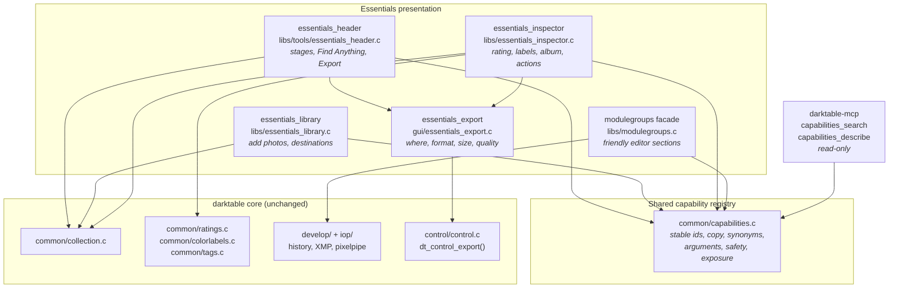
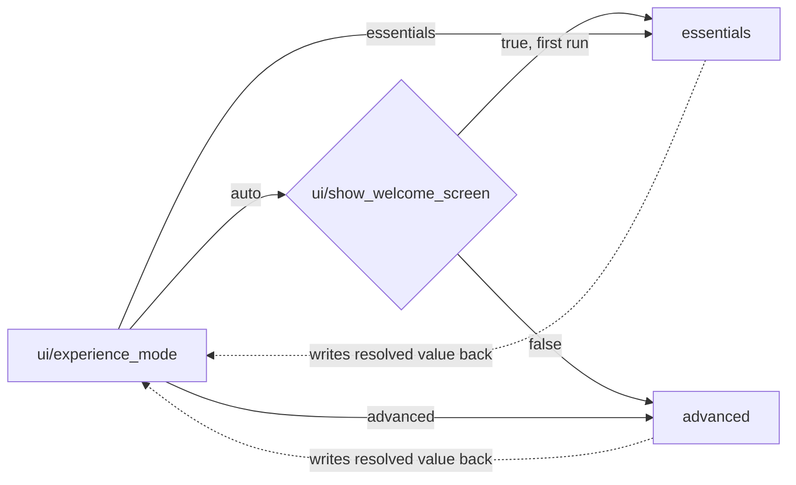
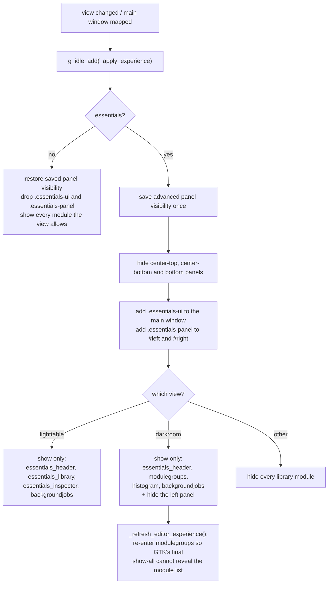
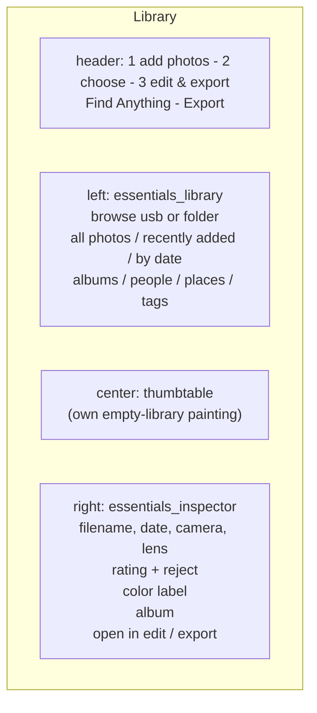
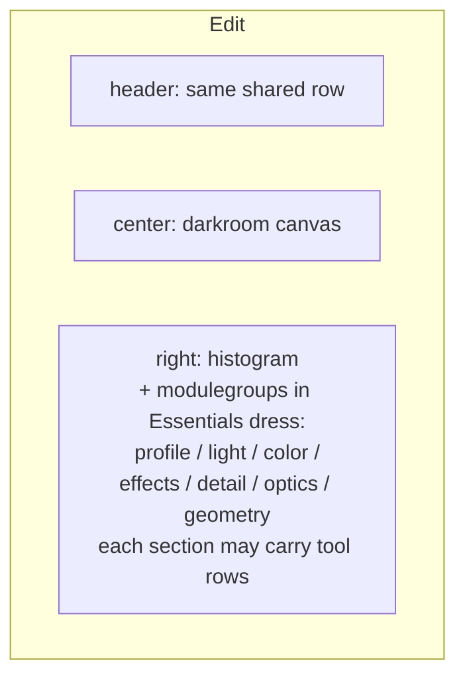
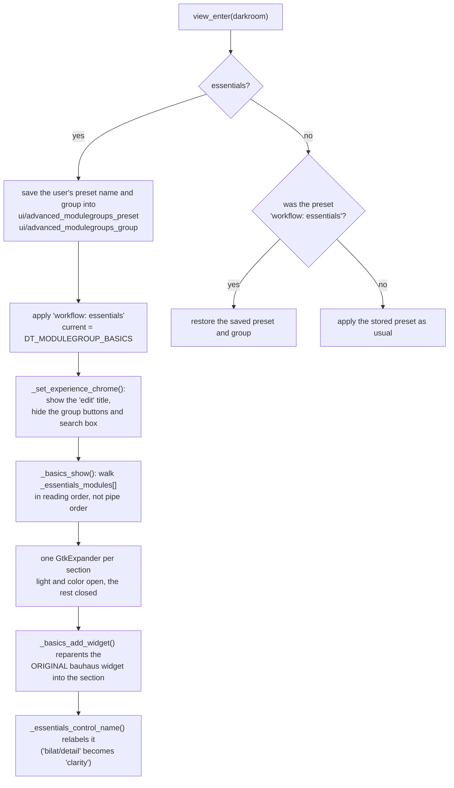
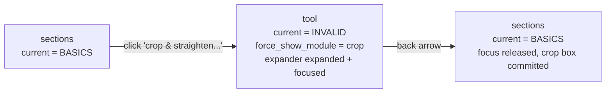
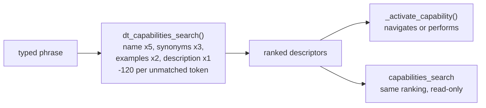
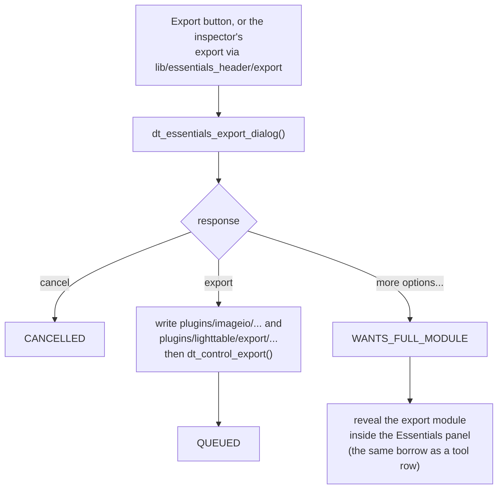

# Essentials UI architecture

Essentials is a second presentation of darktable aimed at someone who has never
used a raw processor. It is a *facade*, not a second application: it shows a
smaller set of the same library modules, drives the same collection, history,
XMP and pixelpipe, and can be turned off at any time from preferences to reveal
the complete interface with the user's own layout intact.

This page describes what is implemented today and where the seams are.
[`Agent_Tool_Architecture.md`](Agent_Tool_Architecture.md) describes the
capability boundary that Essentials and future agents share;
[`Quick_Access_Panel.md`](Quick_Access_Panel.md) describes the widget
reparenting the Essentials editor is built on.

## The one rule

**Essentials never has its own way to change a photo.** Every control is either
an original processing widget that Essentials has borrowed, or a call into the
same function the Advanced interface calls. There is no second parameter path,
no second history stack and no Essentials-only sidecar data. A photo edited in
Essentials and reopened in Advanced shows exactly the edits it was given, under
the module that owns them.

That is what makes the mode safe to offer as a preference rather than a
migration.

## Layers



The descriptor table is built by the `DT_CAPABILITY_DESCRIPTOR` macros. They
carry the `DT_` prefix because a bare `CAPABILITY()` collides with the
thread-safety annotation macro in `src/external/ThreadSafetyAnalysis.h`, which
arrives through `common/dtpthread.h`.

The registry is *descriptive*. Looking a capability up does not perform it: the
UI still calls the core function itself. What the registry guarantees is that
the Library button, the Find Anything result and the MCP description all refer
to the same thing by the same stable id, and that nothing can be advertised to
an agent that no descriptor covers.

`tools/check_capability_registry.py` enforces the second half of that: every
`DT_ESSENTIALS_ACTION("...")` in the Essentials sources must resolve to a
descriptor. It runs as the ctest `test_essentials_capability_registration`.

## Mode

One preference decides everything: `ui/experience_mode`, an enum of `auto`,
`essentials` and `advanced` (`data/darktableconfig.xml.in`, under
`prefs="misc" section="interface"`). `auto` resolves once, on the first run, to
`essentials` for a new user and `advanced` for an existing one, and the resolved
value is written back so the decision is not re-made on later launches.

The preference is the only way between the two interfaces. An earlier build put
an Advanced switch in the Essentials header as well; two routes, one of them a
control sitting in the guided interface it leaves, was the confusing part, and
the switch went when export stopped needing it (see *Export* below). The
`ui.advanced` capability is now a signpost to the preference rather than
something that performs the switch.



`dt_essentials_mode_is_active()` in `gui/gtk.c` is the single reader, used by
`essentials_header.c`, `modulegroups.c`, `dtgtk/thumbtable.c` and `gui/gtk.c`
itself. It resolves `auto` and writes the answer back, so the first caller
settles it and no later caller can disagree. That write, resolving `auto` to a
concrete value, is the only place in `src/` that sets `ui/experience_mode`;
every other change to it comes from the preferences dialog.

It deliberately does not live in `common/capabilities.c`: that file is a pure
registry of static descriptors with no darktable state, and putting a
preference reader in it would have made the registry depend on `control/conf.h`
for a key the registry has nothing to do with.

## What Essentials shows

`essentials_header` owns the facade. It runs in every view, sits in
`DT_UI_CONTAINER_PANEL_TOP_CENTER`, and on each view change queues
`_apply_experience()` on the main loop. That entry point does little itself: the
two halves below it are `_apply_panel_overrides()`, which saves and overrides
panel visibility, and `_apply_module_visibility()`, which filters the module
list.



The visibility pass is a filter over `darktable.lib->plugins`, not a separate
widget tree, and it deliberately does not use `dt_lib_set_visible()`: that
persists the choice under `<view>/<module>_visible`, so hiding a module for
Essentials would rewrite the user's own panel preferences and leave them hidden
in Advanced. Every hidden module is still constructed, still registered, still
holds its shortcuts, and reappears the moment the preference changes. That is
why leaving Essentials costs nothing and loses nothing.

The header is not an exception to its own pass: it is visible when Essentials is
active and hidden otherwise. It used to be pinned visible in both, which left
its stage numbers and Find Anything sitting on top of the complete interface as
a second, overlapping set of controls.

Two details are load-bearing and easy to break:

- the pass must also run on the main window's `map-event`. The darkroom builds
  its image-operation expanders after library modules enter the view, and GTK's
  final `show_all` would otherwise reveal the technical module list.
- panel visibility is *saved before* it is overridden, in
  `advanced_center_top_visible` and friends, and restored on the way out.
  Overriding without saving silently rewrites the user's layout.

### Panel map





The left panel is hidden in Edit, so the editor is one photo and one column of
adjustments.

## The Essentials editor

The editor is the Quick Access Panel wearing different clothes. `modulegroups`
gains a preset, `workflow: essentials`, built in `init_presets()` from the same
`AM()` calls as every other layout, and Essentials selects
`DT_MODULEGROUP_BASICS` on entering the darkroom.



Three consequences worth keeping in mind when editing this code:

- the widget in the Essentials section **is** the module's widget. Moving a
  slider writes the module's parameters through the module's own callback, so
  history, undo, XMP and rendered output are shared with Advanced by
  construction rather than by synchronization.
- the relabelling is presentation only. `item->old_label` records the original
  and `_basics_remove_widget()` puts it back, so the module's own panel is not
  left renamed after a mode switch.
- `_essentials_module_name()` and `_essentials_control_name()` map *op ids* to
  friendly names. They are keyed on stable ids (`bilat/detail`), never on
  translated text, so a non-English UI resolves identically.

#### The one proxy

A module's on/off is the single exception to the first point above, and it is
worth knowing why the exception is safe.

In the complete interface the row is darktable's switch icon plus a label, built
by `dt_iop_gui_header_button()`. In Essentials that pair becomes one check
button carrying the module's friendly name, because an icon whose meaning has to
be learned is exactly what the guided interface is trying to avoid. The check
button is a *proxy*: it is not the module's own button, so `_basics_proxy_toggled()`
and `_basics_target_toggled()` keep the two in step in both directions.

That is still not a second parameter path. The proxy's only action is
`gtk_toggle_button_set_active()` on the module's own on/off, which runs the
module's own handler; nothing writes a parameter except the module. Each
callback compares before it assigns and `gtk_toggle_button_set_active()` emits
nothing when the value is unchanged, so the pair settles after one round trip
rather than recursing.

Two properties of the pair are easy to lose in a refactor:

- `g_signal_connect_object()` is used on the module's button with the proxy as
  the object, because that button outlives the panel; the other direction is a
  plain connection on the proxy, which dies with it. The asymmetry is deliberate.
- when a module has multiple instances the panel disables the row, and *both*
  halves have to go insensitive. The label carries its own click handler, and an
  insensitive `GtkToggleButton` can still be toggled through `set_active()`, so
  disabling only the button leaves the label toggling a module the panel had
  deliberately locked.

Advanced-only affordances - the link to the full module, the preset menu, the
right-click module popup, the "(some features may only be available in the full
module interface)" tooltip - are suppressed rather than replaced.

### Tool mode

Borrowed widgets cannot represent every tool. Crop and perspective need the
canvas, and color grading, the color mixer and the tone curve are whole
notebooks with graphs. A slider named "crop" that cannot draw a crop box is
worse than no control at all.

So a section can also carry **tool rows**: a row that opens that module's own
complete interface inside the Essentials panel, with a back arrow in the title.



`force_show_module` is darktable's existing single-module filter: when it is
set, `_lib_modulegroups_update_iop_visibility()` shows that module's expander
and hides every other, before it ever looks at `d->current`. Two things about
using it are easy to get wrong:

- `_lib_modulegroups_switch_to()` **clears** `force_show_module`, so tool mode
  cannot go through `_lib_modulegroups_set()`. `_essentials_set_tool()` sets the
  group by hand and refreshes through
  `_lib_modulegroups_update_visibility_proxy()`, which leaves it alone.
- leaving a tool must call `dt_iop_request_focus(NULL)` *before* rebuilding the
  panel. Crop commits its box from `gui_focus(self, FALSE)`; dropping the focus
  silently would drop the crop.

Entering a tool destroys the basics box, and with it the button whose `clicked`
handler is running. That is safe only because the handler reads the static tool
spec out first and never touches the button afterwards. `_basics_goto_module()`
has the same shape.

The table is `_essentials_tools[]`. `enabled_only` covers the tone mappers:
filmicrgb, sigmoid, agx and basecurve all sit in the pipe, the workflow decides
which one is on, and only the enabled one earns a row.

| section | module | row |
|---------|--------|-----|
| light | the enabled tone mapper | tone curve... |
| color | `colorbalancergb` | color grading... |
| color | `colorequal` | color mixer... |
| geometry | `crop` | crop & straighten... |
| geometry | `ashift` | rotate & perspective... |

A tool row opens the module's own interface, so improving that interface is how
a tool gets better rather than adding an Essentials-side control. The color
grading row is the worked example: `colorbalancergb`'s 4 ways tab now carries
four `dtgtk_colorwheel` discs, one per range, and both interfaces get them. The
wheel owns no parameter: it writes through `dt_bauhaus_slider_set()` on the
existing hue and chroma sliders and follows their `value-changed` back, so the
one rule holds through it, and the numeric sliders remain the precise input.

Two things about the wheel are surprising enough to be worth stating:
`dtgtk/colorwheel.c` sizes the disc by the chroma slider's *soft* maximum, since
every chroma parameter tops out at 1.0 but is presented over 0.01 to 0.5 and the
hard maximum would squeeze all usable grading into a dot; and it paints with a
separate fixed sweep, because painting over a range of 0.01 renders a gray disc.

A tool must never survive a mode switch or a view change, because the Advanced
panel has no back arrow: `_set_experience_chrome()` and `view_leave()` both
clear `force_show_module`.

The reverse also has to hold. Essentials hides the group buttons, so a group
switch arriving from anywhere else - a module's show shortcut reaching
`_show_module_callback()`, or a history entry - would leave the user in the
technical module list with nothing to click. `_lib_modulegroups_update_iop_visibility()`
therefore snaps the group back to `DT_MODULEGROUP_BASICS` whenever Essentials is
active and no tool is open.

## Capabilities in the UI

Every Essentials action names a capability:

```c
g_return_if_fail(dt_capability_get(DT_ESSENTIALS_ACTION("library.rate")));
```

The lookup is cheap and its real purpose is the CI check: an action with no
descriptor cannot ship. `library.*` covers navigation and organization,
`edit.*` the adjustments, `export.*` and `ui.*` the rest. Ids are stable and
unlocalized; the visible label lives in the descriptor's `name` and may be
translated freely without touching an id or a stored plan.

Find Anything is the registry's other consumer.
`dt_capabilities_search()` scores a query against each descriptor's name,
description, synonyms and examples, subtracting for tokens that match nothing,
and returns a deterministic ranking. There is no model in this path: typing
"make brighter" finds `edit.exposure.adjust` because the descriptor says so.



### Confirmation policy

`requires_confirmation` in a descriptor governs the *agent* lifecycle in
`Agent_Tool_Architecture.md`: request, plan, preview, confirm, commit. It is not
a per-click policy for a human, because a click on a single photo already is the
confirmation.

The inspector therefore confirms only what reaches photos it is not describing:
`_confirmed()` shows a dialog when the action would touch two or more images and
applies straight away for one. Rating, reject, color label and album all go
through it.

### Albums

darktable has no album table, and Essentials does not add one. An album is a
darktable tag under one reserved hierarchy, `album|`, declared as
`DT_ESSENTIALS_ALBUM_PREFIX` in `common/capabilities.h`:

- adding to an album is `dt_tag_attach_string_list("album|Landscapes", ...)`
- the Library's *albums* destination is a collection rule on
  `DT_COLLECTION_PROP_TAG` with the text `album*`, the trailing `*` selecting
  the whole hierarchy (see `get_query_string()` in `common/collection.c:1677`)
- the inspector lists the current photo's albums by filtering its attached tags
  on the same prefix

So an album is visible in the Advanced tagging module, travels in the XMP
sidecar, and survives a user who never opens Essentials again.

## Export

`gui/essentials_export.c` asks the four questions that decide an export - where,
what format, how large, how good - and hands everything else to the same
`dt_control_export()` the full module calls.



The dialog is a *view* of the export configuration, not a second one. It writes
the keys the full module reads - `plugins/lighttable/export/storage_name` and
`format_name`, `plugins/imageio/format/jpeg/quality`,
`plugins/imageio/storage/disk/file_directory` - so "more options..." opens the
full module already showing what was chosen here, and a setting the dialog does
not ask about (profile, style, metadata) keeps whatever the full module last
had. There is one export configuration seen at two levels of detail.

`more options...` does not leave Essentials. It reveals the real export module
inside the Essentials panel, which is the same borrow a tool row performs; the
next view change tidies it away. Before this existed, export set
`ui/experience_mode` to advanced and dropped the user into the complete
interface to finish the one step the guided workflow is named after.

### file_directory is a pattern

The one genuine trap. `plugins/imageio/storage/disk/file_directory` is a
*filename pattern*, not a folder; its default is
`$(FILE_FOLDER)/darktable_exported/$(FILE_NAME)`. Storing a bare folder there
makes `disk.c` treat the whole path as the output file's name, so a folder named
`Exports` produces `Exports.jpg`, then `Exports_01.jpg`, and nothing lands inside
it.

Both sides of that have a fallback, and neither covers a folder from a chooser:

- `cli/main.c:588` tests the output location with `G_FILE_TEST_IS_DIR` and
  appends `/$(FILE_NAME)` itself
- `disk.c:396` appends `$(FILE_NAME)` only when the *expanded* pattern ends in a
  separator, which a chooser's `/Users/.../Exports` does not

So the dialog appends `$(FILE_NAME)` on the way in, and
`dt_essentials_export_directory_from_pattern()` takes the folder back out on the
way to the chooser. That function is exported from the header for one reason:
`src/tests/unittests/test_essentials_export.c` pins it against a pattern with a
variable, a plain path with none, and an empty value falling back to
`G_USER_DIRECTORY_PICTURES` then the home directory.

### Dialogs are separate toplevels

A dialog is its own `GtkWindow`, so the `.essentials-ui` class on the main
window cannot reach it through the style context.
`dt_gui_dialog_apply_experience()` in `gui/gtk.c` carries the class across and
marks the default response with `.suggested-action`, because GTK3 has no
`:default` pseudo-class and cancel and accept would otherwise carry identical
weight. Any Essentials dialog should call it.

## Styling

Essentials adds no widget theme of its own. It adds three hooks to
`data/themes/darktable.css` and styles through them:

| hook | applied to | by |
|------|-----------|-----|
| `.essentials-ui` | the main window | `_apply_experience()` |
| `.essentials-panel` | `#left`, `#right` | `_apply_experience()`, `_set_experience_chrome()` |
| `.essentials-editor` | the quick-access box | `_basics_show()` |

plus widget names (`#essentials-header`, `#essentials-library`,
`#essentials-inspector`, `#essentials-rating`, `#essentials-color-labels`,
`#essentials-album`, `#essentials-edit-section`, `#essentials-tool`,
`#essentials-tool-back`) for the individual surfaces.
Because everything is scoped under those, the rules cost nothing when the mode
is off. That is worth checking rather than assuming: a stylesheet loaded through
`GtkCssProvider` will report a computed background for every widget and every
CSS node, so the complete interface can be resolved with and without the class
and the two compared. An unscoped rule shows up immediately.

Constraints learned the hard way:

- keep to conservative, widely supported GTK CSS properties. An unsupported
  property crashed style computation on macOS.
- state that the user must read - a set rating, an attached color label - has to
  be drawn, not merely set. `dtgtk_cairo_paint_star()` fills a star only when it
  is handed a color as paint data, so `dtgtk_button_set_active()` alone changes
  nothing on screen.
- several things that need styling are CSS nodes with no widget of their own:
  `check`, `scale trough`, `scale highlight`, `progressbar progress`, `popover`,
  `menu menuitem`, `tooltip`, `switch slider`. A selector aimed at the widget
  misses them.
- a class lands where the C put it. `.essentials-ui treeview` matches a dialog's
  tree, `.essentials-ui dialog treeview` matches nothing, because
  `dt_gui_dialog_apply_experience()` puts the class *on* the dialog.

### The accent is two blues

Anything carrying white text - the primary buttons, a selected row, a selection
in an entry - uses `#2e6cb3`, hovering to `#3376c5` and pressing to `#2961a1`.
The indicators that carry nothing on them - switch, checkbox, slider highlight,
progress - keep the lighter `#397dcc`.

They differ because the two jobs pull in opposite directions. White text needs
the blue dark enough to contrast against the text: at `#397dcc` that is 4.22:1,
under the 4.5:1 WCAG AA asks for at normal text size. The indicators sit on a
`#2b3036` trough and need the blue *light* enough to contrast against that;
darkening them to the text-bearing shade drops them to 2.48:1, under the 3:1
non-text elements need. One shade cannot satisfy both, so a new use of the
accent has to pick the one that matches its job.

## Other core touch points

| file | change | why |
|------|--------|-----|
| `dtgtk/thumbtable.c` | `_lighttable_expose_essentials_empty()` | the legacy empty-collection diagram explains darktable's panels, which Essentials has hidden |
| `gui/gtk.c` | `_sidebar_scrolls_by_default()` | the side panel scrolls under the pointer without a modifier; Advanced keeps the user's `darkroom/ui/sidebar_scroll_default` preference |
| `gui/gtk.c` | `dt_gui_image_surround_color()` | the ground behind a photo, chosen by `ui/essentials_surround` |
| `gui/gtk.c` | `dt_gui_dialog_apply_experience()` | a dialog is its own toplevel and cannot inherit the class |
| `data/CMakeLists.txt` | installs `data/capabilities` | the versioned wire schemas |

### The ground behind a photo

The tone behind the image is drawn by the views, not by CSS, so it cannot be a
class. `dt_gui_image_surround_color()` takes the color the complete interface
would use and returns it unchanged unless Essentials is active, in which case
`ui/essentials_surround` picks between graphite, charcoal, slate and neutral -
`neutral` being the complete interface's own value. The callers are
`views/darkroom.c`, `views/view.c`, `libs/snapshots.c`, `dtgtk/thumbtable.c` and
`dtgtk/thumbnail.c`.

It is a preference rather than a redefinition of darktable's grays because those
grays are already perceptually uniform: every `grey_NN` in the theme lands within
0.23 of L\* = NN, so there is nothing wrong with the ramp to fix. What varies is
what a person wants behind their photo.

One rule about the enum backing it, learned by crashing: **append**
`dt_gui_color_t` values before `DT_GUI_COLOR_LAST`, never insert. Every
processing and library module is a separately built plugin holding indices into
that enum, so inserting a value shifts every index after it in the plugins that
were not rebuilt. That SIGSEGVs at startup rather than failing to build, which
is the worst way to find out.

## Running it

`tools/run-essentials-local.sh` starts the build-tree binary against an isolated
config, cache and library so the first-run path can be exercised without
touching a real catalog. It also refreshes
`build/share/darktable/themes/darktable.css`, because `FILE(COPY ...)` only runs
at configure time.

It deliberately does not force `ui/experience_mode`. On a fresh profile the
`auto` resolution above lands on `essentials` and writes that back, so the
script exercises the same path a new user gets rather than going around it.

```bash
./tools/run-essentials-local.sh ~/Pictures/some-folder
```

## Known gaps

- Export writes the configuration keys and calls `dt_control_export()` directly.
  It is not a typed plan, so it gains nothing from the executor described in
  `Agent_Tool_Architecture.md` and an agent cannot request one.
- Masks, and any other module needing the canvas, have no tool row yet. Adding
  one is a table entry plus a capability, but drawn and parametric masks also
  need a friendly vocabulary before they are worth exposing.
- *people* and *tags* both open the tag browser unfiltered; only *albums* has a
  hierarchy of its own.
- Auto/Profile controls are absent on purpose. A visually plausible button with
  no capability behind it would be worse than no button.
- The Essentials editor's section list, `_essentials_modules[]`, is a literal
  table. It does not adapt to a camera or workflow that lacks one of those
  modules beyond skipping it.
- In Essentials a module with multiple instances shows a disabled toggle with
  no explanation. The tooltip is set on the check button, and GTK3 does not
  deliver enter or leave events to an insensitive widget, so it never appears.
  The complete interface avoids this by keeping the label in its own event box.
- The Essentials on/off proxy registers no action, so unlike
  `dt_iop_gui_header_button()`'s switch it cannot be reached by shortcut.
