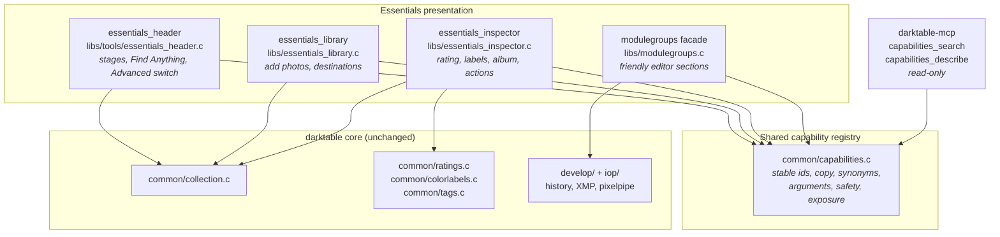
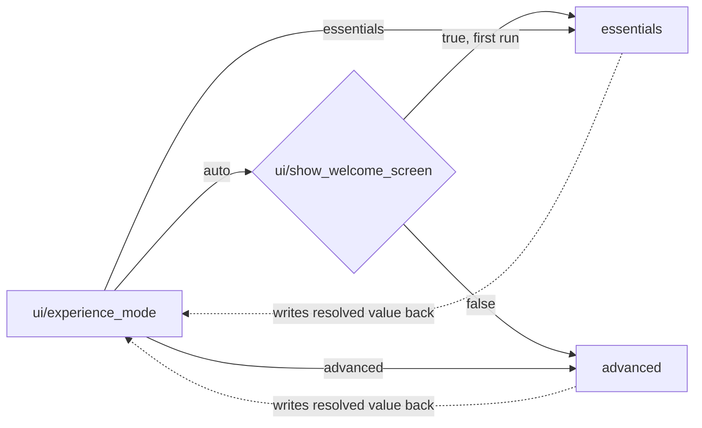
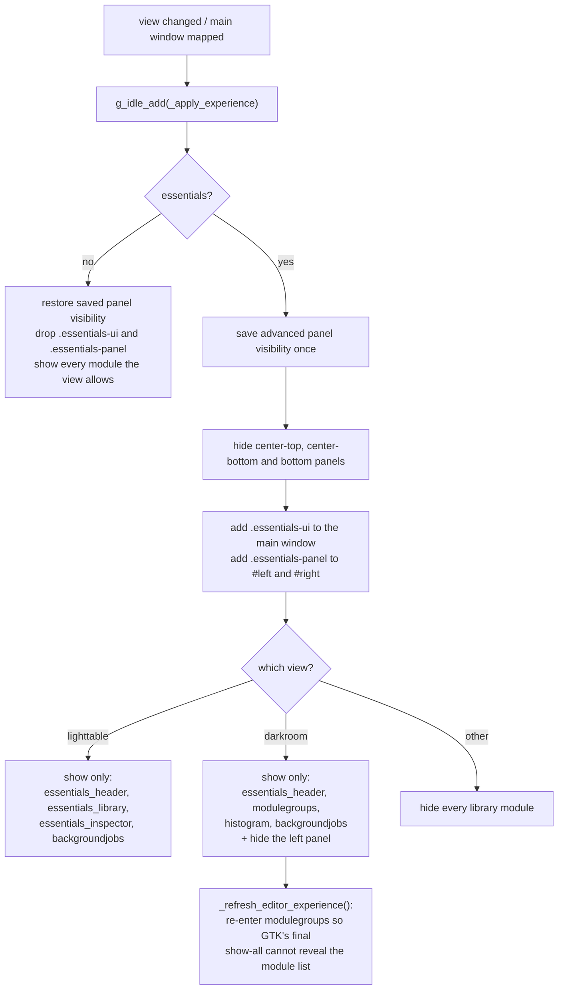
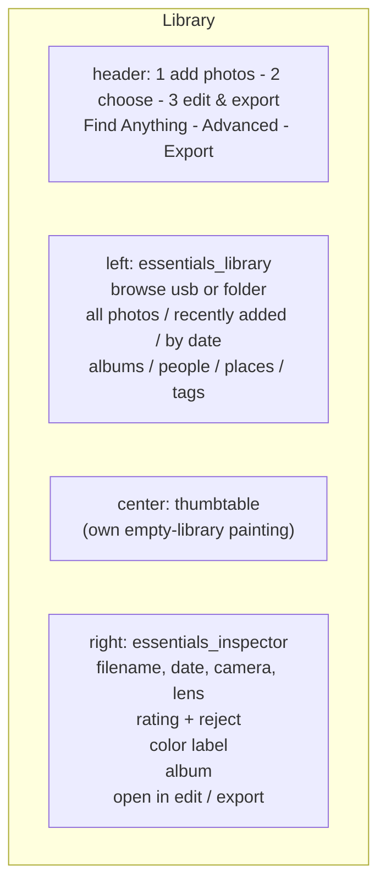
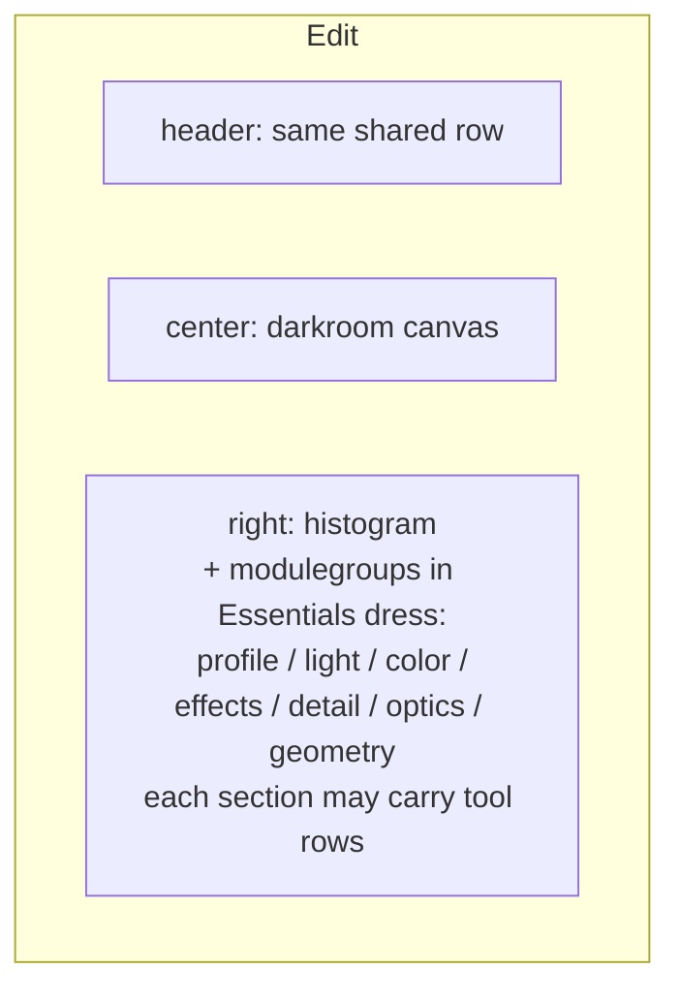
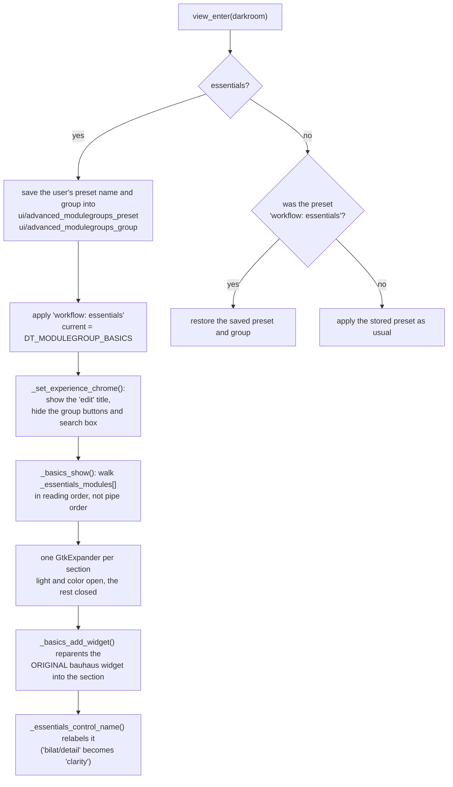
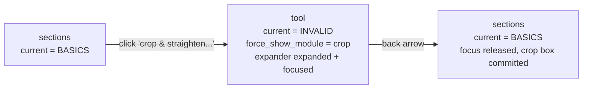
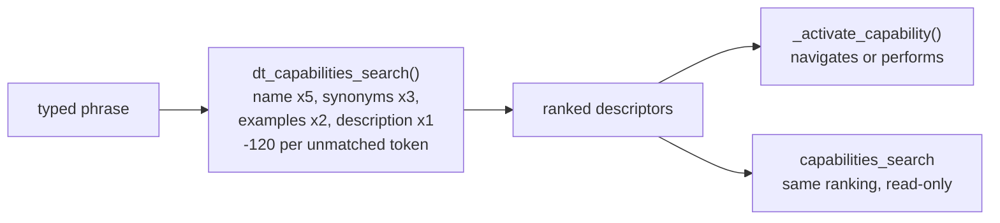

# Essentials UI architecture

Essentials is a second presentation of darktable aimed at someone who has never
used a raw processor. It is a *facade*, not a second application: it shows a
smaller set of the same library modules, drives the same collection, history,
XMP and pixelpipe, and can be turned off at any time to reveal the complete
interface with the user's own layout intact.

This page describes what is implemented today and where the seams are.
[`Agent_Tool_Architecture.md`](Agent_Tool_Architecture.md) describes the
capability boundary that Essentials and future agents share;
[`Quick_Access_Panel.md`](Quick_Access_Panel.md) describes the widget
reparenting the Essentials editor is built on.

## The one rule

**Essentials never has its own way to change a photo.** Every control is either
an original processing widget that Essentials has borrowed, or a call into the
same function the Advanced interface calls. There is no second parameter path,
no second history stack and no Essentials-only sidecar data. A photo edited in
Essentials and reopened in Advanced shows exactly the edits it was given, under
the module that owns them.

That is what makes the mode switch safe to offer as a toggle rather than a
migration.

## Layers



The descriptor table is built by the `DT_CAPABILITY_DESCRIPTOR` macros. They
carry the `DT_` prefix because a bare `CAPABILITY()` collides with the
thread-safety annotation macro in `src/external/ThreadSafetyAnalysis.h`, which
arrives through `common/dtpthread.h`.

The registry is *descriptive*. Looking a capability up does not perform it: the
UI still calls the core function itself. What the registry guarantees is that
the Library button, the Find Anything result and the MCP description all refer
to the same thing by the same stable id, and that nothing can be advertised to
an agent that no descriptor covers.

`tools/check_capability_registry.py` enforces the second half of that: every
`DT_ESSENTIALS_ACTION("...")` in the Essentials sources must resolve to a
descriptor. It runs as the ctest `test_essentials_capability_registration`.

## Mode

One preference decides everything: `ui/experience_mode`, an enum of `auto`,
`essentials` and `advanced` (`data/darktableconfig.xml.in`). `auto` resolves
once, on the first run, to `essentials` for a new user and `advanced` for an
existing one, and the header writes the resolved value back so the decision is
not re-made on later launches.



`dt_essentials_mode_is_active()` in `common/capabilities.c` is the single
reader, used by `essentials_header.c`, `modulegroups.c`, `dtgtk/thumbtable.c`
and `gui/gtk.c`. It resolves `auto` and writes the answer back, so the first
caller settles it and no later caller can disagree. Only the header *writes* the
mode, from the Advanced switch.

## What Essentials shows

`essentials_header` owns the facade. It runs in every view, sits in
`DT_UI_CONTAINER_PANEL_TOP_CENTER`, and on each view change queues
`_apply_experience()` on the main loop.



The visibility pass is a filter over `darktable.lib->plugins`, not a separate
widget tree, and it deliberately does not use `dt_lib_set_visible()`: that
persists the choice under `<view>/<module>_visible`, so hiding a module for
Essentials would rewrite the user's own panel preferences and leave them hidden
in Advanced. Every hidden module is still constructed, still registered, still
holds its shortcuts, and reappears the moment the switch is flipped. That is
why leaving Essentials costs nothing and loses nothing.

Two details are load-bearing and easy to break:

- the pass must also run on the main window's `map-event`. The darkroom builds
  its image-operation expanders after library modules enter the view, and GTK's
  final `show_all` would otherwise reveal the technical module list.
- panel visibility is *saved before* it is overridden, in
  `advanced_center_top_visible` and friends, and restored on the way out.
  Overriding without saving silently rewrites the user's layout.

### Panel map





The left panel is hidden in Edit, so the editor is one photo and one column of
adjustments.

## The Essentials editor

The editor is the Quick Access Panel wearing different clothes. `modulegroups`
gains a preset, `workflow: essentials`, built in `init_presets()` from the same
`AM()` calls as every other layout, and Essentials selects
`DT_MODULEGROUP_BASICS` on entering the darkroom.



Three consequences worth keeping in mind when editing this code:

- the widget in the Essentials section **is** the module's widget. Moving a
  slider writes the module's parameters through the module's own callback, so
  history, undo, XMP and rendered output are shared with Advanced by
  construction rather than by synchronization.
- the relabelling is presentation only. `item->old_label` records the original
  and `_basics_remove_widget()` puts it back, so the module's own panel is not
  left renamed after a mode switch.
- `_essentials_module_name()` and `_essentials_control_name()` map *op ids* to
  friendly names. They are keyed on stable ids (`bilat/detail`), never on
  translated text, so a non-English UI resolves identically.

Advanced-only affordances - the link to the full module, the preset menu, the
right-click module popup, the "(some features may only be available in the full
module interface)" tooltip - are suppressed rather than replaced.

### Tool mode

Borrowed widgets cannot represent every tool. Crop and perspective need the
canvas, and color grading, the color mixer and the tone curve are whole
notebooks with graphs. A slider named "crop" that cannot draw a crop box is
worse than no control at all.

So a section can also carry **tool rows**: a row that opens that module's own
complete interface inside the Essentials panel, with a back arrow in the title.



`force_show_module` is darktable's existing single-module filter: when it is
set, `_lib_modulegroups_update_iop_visibility()` shows that module's expander
and hides every other, before it ever looks at `d->current`. Two things about
using it are easy to get wrong:

- `_lib_modulegroups_switch_to()` **clears** `force_show_module`, so tool mode
  cannot go through `_lib_modulegroups_set()`. `_essentials_set_tool()` sets the
  group by hand and refreshes through
  `_lib_modulegroups_update_visibility_proxy()`, which leaves it alone.
- leaving a tool must call `dt_iop_request_focus(NULL)` *before* rebuilding the
  panel. Crop commits its box from `gui_focus(self, FALSE)`; dropping the focus
  silently would drop the crop.

Entering a tool destroys the basics box, and with it the button whose `clicked`
handler is running. That is safe only because the handler reads the static tool
spec out first and never touches the button afterwards. `_basics_goto_module()`
has the same shape.

The table is `_essentials_tools[]`. `enabled_only` covers the tone mappers:
filmicrgb, sigmoid, agx and basecurve all sit in the pipe, the workflow decides
which one is on, and only the enabled one earns a row.

| section | module | row |
|---------|--------|-----|
| light | the enabled tone mapper | tone curve... |
| color | `colorbalancergb` | color grading... |
| color | `colorequal` | color mixer... |
| geometry | `crop` | crop & straighten... |
| geometry | `ashift` | rotate & perspective... |

A tool must never survive a mode switch or a view change, because the Advanced
panel has no back arrow: `_set_experience_chrome()` and `view_leave()` both
clear `force_show_module`.

The reverse also has to hold. Essentials hides the group buttons, so a group
switch arriving from anywhere else - a module's show shortcut reaching
`_show_module_callback()`, or a history entry - would leave the user in the
technical module list with nothing to click. `_lib_modulegroups_update_iop_visibility()`
therefore snaps the group back to `DT_MODULEGROUP_BASICS` whenever Essentials is
active and no tool is open.

## Capabilities in the UI

Every Essentials action names a capability:

```c
g_return_if_fail(dt_capability_get(DT_ESSENTIALS_ACTION("library.rate")));
```

The lookup is cheap and its real purpose is the CI check: an action with no
descriptor cannot ship. `library.*` covers navigation and organization,
`edit.*` the adjustments, `export.*` and `ui.*` the rest. Ids are stable and
unlocalized; the visible label lives in the descriptor's `name` and may be
translated freely without touching an id or a stored plan.

Find Anything is the registry's other consumer.
`dt_capabilities_search()` scores a query against each descriptor's name,
description, synonyms and examples, subtracting for tokens that match nothing,
and returns a deterministic ranking. There is no model in this path: typing
"make brighter" finds `edit.exposure.adjust` because the descriptor says so.



### Confirmation policy

`requires_confirmation` in a descriptor governs the *agent* lifecycle in
`Agent_Tool_Architecture.md`: request, plan, preview, confirm, commit. It is not
a per-click policy for a human, because a click on a single photo already is the
confirmation.

The inspector therefore confirms only what reaches photos it is not describing:
`_confirmed()` shows a dialog when the action would touch two or more images and
applies straight away for one. Rating, reject, color label and album all go
through it.

### Albums

darktable has no album table, and Essentials does not add one. An album is a
darktable tag under one reserved hierarchy, `album|`, declared as
`DT_ESSENTIALS_ALBUM_PREFIX` in `common/capabilities.h`:

- adding to an album is `dt_tag_attach_string_list("album|Landscapes", ...)`
- the Library's *albums* destination is a collection rule on
  `DT_COLLECTION_PROP_TAG` with the text `album*`, the trailing `*` selecting
  the whole hierarchy (see `get_query_string()` in `common/collection.c:1677`)
- the inspector lists the current photo's albums by filtering its attached tags
  on the same prefix

So an album is visible in the Advanced tagging module, travels in the XMP
sidecar, and survives a user who never opens Essentials again.

## Styling

Essentials adds no widget theme of its own. It adds three hooks to
`data/themes/darktable.css` and styles through them:

| hook | applied to | by |
|------|-----------|-----|
| `.essentials-ui` | the main window | `_apply_experience()` |
| `.essentials-panel` | `#left`, `#right` | `_apply_experience()`, `_set_experience_chrome()` |
| `.essentials-editor` | the quick-access box | `_basics_show()` |

plus widget names (`#essentials-header`, `#essentials-library`,
`#essentials-inspector`, `#essentials-rating`, `#essentials-color-labels`,
`#essentials-album`, `#essentials-edit-section`, `#essentials-tool`,
`#essentials-tool-back`) for the individual surfaces.
Because everything is scoped under those, the rules cost nothing when the mode
is off.

Two constraints learned the hard way, both recorded in `design-qa.md`:

- keep to conservative, widely supported GTK CSS properties. An unsupported
  property crashed style computation on macOS.
- state that the user must read - a set rating, an attached color label - has to
  be drawn, not merely set. `dtgtk_cairo_paint_star()` fills a star only when it
  is handed a color as paint data, so `dtgtk_button_set_active()` alone changes
  nothing on screen.

## Other core touch points

| file | change | why |
|------|--------|-----|
| `dtgtk/thumbtable.c` | `_lighttable_expose_essentials_empty()` | the legacy empty-collection diagram explains darktable's panels, which Essentials has hidden |
| `gui/gtk.c` | `_sidebar_scrolls_by_default()` | the side panel scrolls under the pointer without a modifier; Advanced keeps the user's `darkroom/ui/sidebar_scroll_default` preference |
| `data/CMakeLists.txt` | installs `data/capabilities` | the versioned wire schemas |

## Running it

`tools/run-essentials-local.sh` starts the build-tree binary against an isolated
config, cache and library so the mode switch and first-run path can be exercised
without touching a real catalog. It also refreshes
`build/share/darktable/themes/darktable.css`, because `FILE(COPY ...)` only runs
at configure time.

```bash
./tools/run-essentials-local.sh ~/Pictures/some-folder
```

## Known gaps

- Export in Essentials opens the Advanced export module and says so. A focused
  export surface needs the plan executor to exist first.
- Masks, and any other module needing the canvas, have no tool row yet. Adding
  one is a table entry plus a capability, but drawn and parametric masks also
  need a friendly vocabulary before they are worth exposing.
- *people* and *tags* both open the tag browser unfiltered; only *albums* has a
  hierarchy of its own.
- Auto/Profile controls are absent on purpose. A visually plausible button with
  no capability behind it would be worse than no button.
- The Essentials editor's section list, `_essentials_modules[]`, is a literal
  table. It does not adapt to a camera or workflow that lacks one of those
  modules beyond skipping it.
